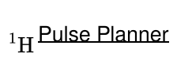
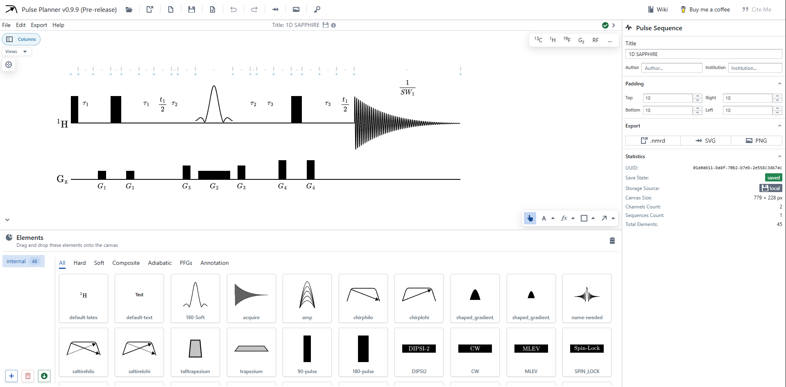

<div align="center">
  🔥 <a href="https://www.nmr.chemistry.manchester.ac.uk/PSI/">Link to page</a> 🔥
</div>

---

<p align="center">
  
</p>

<div align="center">
  
      [](https://github.com/ProgramPhantom/PSI/actions/workflows/pages/pages-build-deployment) 
  
</div>

<div align="center">
  🌐 <a href="https://www.nmr.chemistry.manchester.ac.uk/PSI/wiki">Link to wiki</a>
</div>

Pulse Planner is a web application for creating Nuclear Magnetic Resonance (NMR) pulse sequence diagrams. These diagrams describe sequences of electromagnetic pulses that are fired at samples to determine their molecular makeup. By recording the feedback from these pulses coming off the sample, precise information can be acquired regarding the composition of the sample. The specifics of the type of pulses and the order in which they are fired can change the accuracy of the results, making construction of NMR pulse sequences an important, highly useful area of Chemistry.

You can check out some example pulse sequnce diagrams on the Manchester NMR Methodology Group's website [here](https://www.nmr.chemistry.manchester.ac.uk/?q=node/327).

## 🔨 Features

Pulse planner was created to revolutionise the way scientists can plan NMR pulses sequences. It allows the rapid prototyping, annotating and sharing beautifully formatted pulse sequence images. Pulse planner makes it as easy as a drag and a drop to start creating professional, publication ready, and contains with unlimited customisation capabilities. Here are a few of the features this application provides:

- Enables the rapid prototyping of NMR pulses sequences
- Provides a declarative positioning system, meaning users need not worry about formatting and positioning of graphical elements
- Provides a platform to formalise syntax for pulse sequence diagrams
- The ability to share and collaborate on pulse sequence diagrams
- Inlcudes a flexible components based system, which allows concepts for new pulses to be uploaded and shared

## ✍ How to use



Pulse Planner was made with the user experience in mind. To use the application fulently, liken yourself to some of the terminology for different aspects of the UI.

- Canvas: this is the pannable and zoomable area in the top left of the screen. This is where you interact with your pulse sequence diagram. This is the target for drag and drop operations, and allows you to select and move elements.
- Elements draw: this is the area below the canvas. It contains all your pulse "prefabs", pre-configured pulses that you can easily add to the canvas with a simple drag and drop. It also contains functionality to add "Schemes" - transportable collections of pulses and other elements that can be created, inported and exported in this area.
- Form: the area on the right of the screen is for modifying elements.
- Banner: the banner at the top of the screen contains useful tools for saving and loading diagrams.

### To get started using Pulse Planner

1. Create a new channel by pressing one of the buttons in the top right of the canvas.
2. Drag and drop elements from the elements draw to the diagram. When dragging, drop areas appear on the channels for adding pulses. Hover the mouse over one of these options and let go to fix the pulse in place. Objects are either inserted into a channel (from these hover areas) or added directly to the diagram (by dragging and dropping elsewhere in the diagram).
3. To interact with placed pulses, click on that pulse. You can modify a pulse by changing the fields that appear in the form on the right. You can also delete pulses here by pressing the red bin button (or `DEL`/`BACKSPACE`).
4. When no pulse is selected, you can add a new channel on the right.
5. When you are happy with your sequence, choose one of the two export buttons on the banner to retrieve a PNG or SVG file.
6. To save your pulse locally, click the "Save" button or, `CTRL+S`.
7. If you wish to export your pulse to give to someone else and for safe-keeping, click the "Export .nmrd" button on the banner (`CTRL+ALT+S`). You can then load this diagram file by pressing the "Open" button on the banner (`CTRL+O`).

## ⚙ Positional Logic And Computation Engine (PLACE)

Pulse Planner is a client side single page web application built using the <kbd>[react](https://react.dev/)</kbd> framework and <kbd>[typescript](https://www.typescriptlang.org/)</kbd>. 

At the heart of Pulse Planner is a small, lightweight custom layout manager, called PLACE. PLACE defines and controls the layout of the pulse sequence diagrams automatically, allowing for declarative diagramming, whilst remaining flexible enough to adhere to the plethora of design requirements NMR diagrams entail. PLACE is written purely in typescript.

### 👩‍💻 For developers

We use <kbd>vite</kbd> to host a developer server. First, make sure your computer has node.js installed, follow the instructions here: [https://nodejs.org/en/download](https://nodejs.org/en/download).
First, clone the repository to somewhere on your computer:

```
git clone https://github.com/ProgramPhantom/PSI.git
```

navigate to the repository and install vite with:
Once you've done that, install vite with

```
npm install -D vite
```

and install necessary node modules locally with 

```
npm i
```

Now you have access to host the program locally with the Vite webserver. Run it by running `npm run dev` in the terminal.
