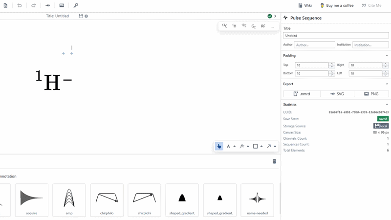

# Box tool

The box tool is used for creating rect objects on the canvas. Select the box tool by clicking the box icon shown above, or by clicking the up-carat and customising the box style.

Then, create a box on the canvas by clicking, dragging the mouse and clicking elsewhere on the canvas.

:::tip

In order to give the box no fill, set the "Fill Opacity" to 0% 

:::