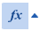
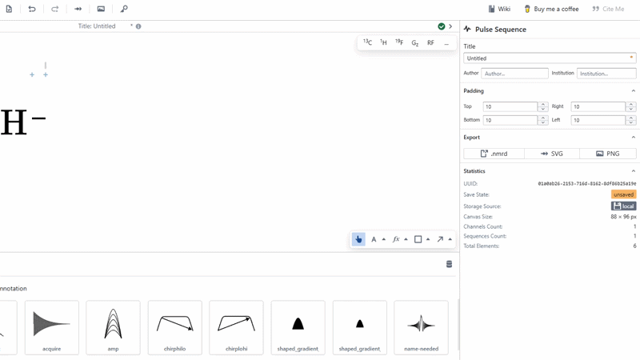

# LaTeX

The LaTeX tool is used to create standard LaTeX math-mode SVG objects directly on the canvas. Simply select the LaTeX tool, click on the canvas where you wish to create the object and input standard math-mode LaTeX. Deselect the text box to see this appear beautifully formatted on the canvas.

Customise the LaTeX object on the right form, including changing its font size.

:::info

LaTex font size is normalised with the text tool and standard font sizes. When exporting the diagram as an SVG in original size, the font size of the imported SVG in word should match up with other fonts. 

:::

:::tip

You may wish to format multi-character strings in LaTeX by wrapping it in `\text{}`.

:::