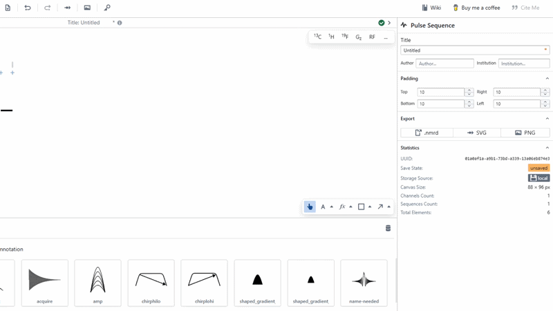

# Arrow Tool

The line tool is used for creating lines, arrows and brackets on the canvas.

Simply select the line tool, or click the up-carat to customise your line before you draw it. In the pop-up, you can customise the arrow heads, line thickness, line colour and dashing style. To make a bracket, select the "Bracket" arrow head for both the start and end of the line. 

Once ready, click-drag-click on the canvas to create a line.

You may then continue customising this line from the right form.

### Adjustment

Sometimes arrowheads may not line up perfectly with the object they are pointing at. To accommodate for this, `Adjustment` was made to provide a way to add a small visual shift to the end of the arrowhead. Change the adjustment and notice the ends of the line move slightly. 

:::tip

When creating a line using the line tool, or resizing a line, holding `CTRL` will snap the line to the nearest cardinal direction, for the creation of perfectly straight lines.

:::

