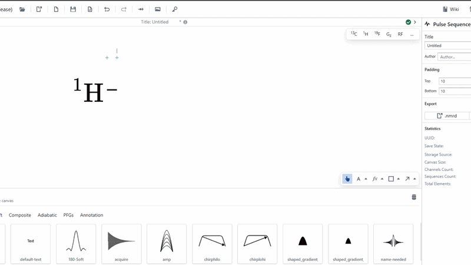

# Text

The text tool is used for adding standard text objects to the canvas, quickly and easily. 

To get started using the text tool, simply select it on the canvas toolbar and click on the canvas in the position you wish to create some text. Enter the desired text and hit enter or click away. 

Additionally, you may wish to modify the text before creating it by selecting the up-carat to reveal a customisation menu. You may modify the text further by controlling its attributes using the form on the right of the screen, present while it is selected.

:::info

Font size can be controlled on the right form. Font size is normalised for standard SVG output, so a font size of 10 will be the same as the size 10 font in your paper, as long as no scaling has happened.

:::