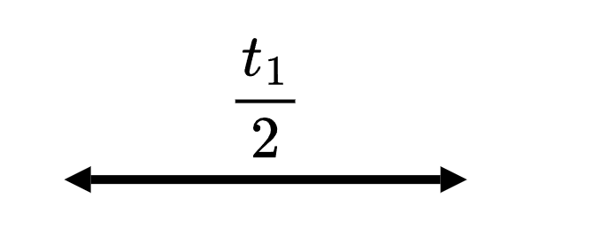
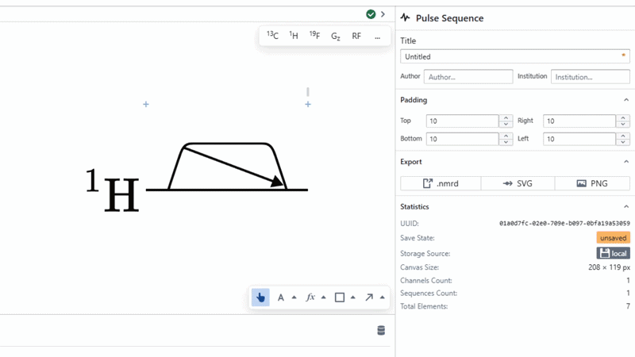

# Label

Label is an annotation object that contains a [LaTeX](./latex) and [line](./line.md). It is used to automatically position these two elements relative to each other, either in a vertical or horizontal fashion. This element is useful for creating labelled spans of pulses to denote pulse duration.

It is very common to use this element in conjunction with the [LabelGroup](../labelGroup.md) object to create a beautiful labelled pulse.

### Text Position

The line and text objects can be positioned relative to each other by changing the Text Position attribute found in the right form. This changes whether the LaTeX object is located above, below or inline with the Line object. 

:::tip

To change the spacing between the Line and LaTeX children of a Label, use [offset](../../concepts/offset.md) or [padding](../../concepts/padding.md).

:::