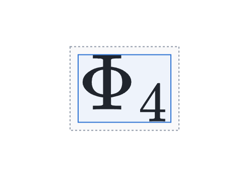
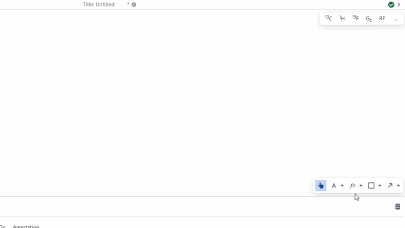
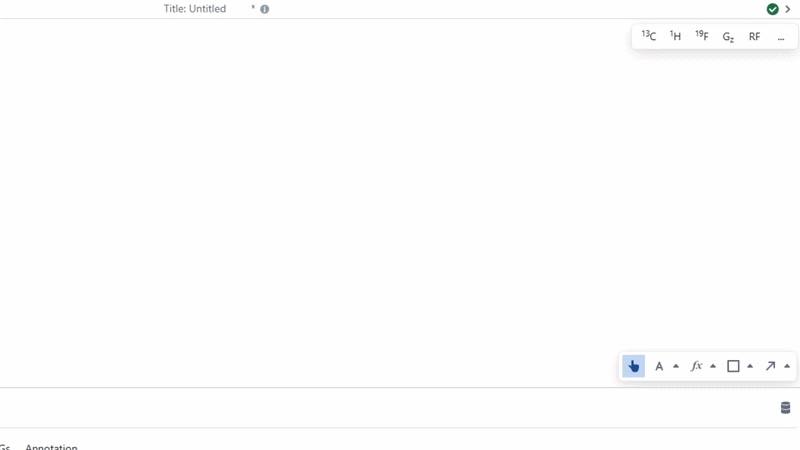

# LaTeX

The `LaTeX` object can be used to create beautifully rendered mathematics directly in the application. The easiest way to add a LaTeX object is to use the [LaTeX tool](../../canvasTools/latex.md) in the bottom right of the the canvas. 

Font size of LaTeX objects can be found under the "Style" heading in the form when selecting the object.

You can modify the LaTeX content by selecting a LaTeX object and changing the text field, or by double clicking on the selected LaTeX object and modifying the text displayed.

:::note

LaTeX font sizes are normalised in Pulse Planner, so size 12 in this app should be the same as in Microsoft Word.

:::