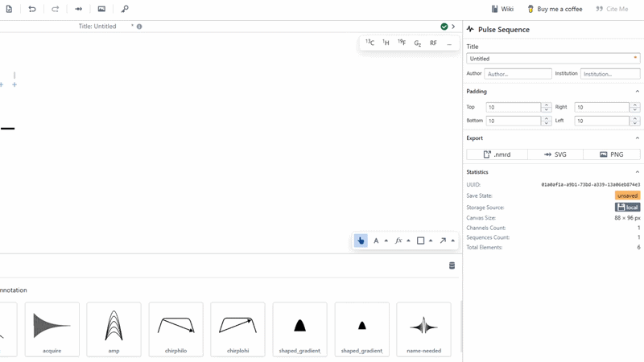

# Line

Lines and arrows are added to the diagram using the [Line Tool](../../canvasTools/line.md) in the bottom right of the canvas. To add a line, select the line tool and then click-drag-click on the canvas. The instantiated line can be modified by selection and use of the form or this can be specified before the user uses the line tool by pressing on the up-carat and changing some of the formatting details there. 

:::tip

Lines are compatible with the [binding](../../concepts/bindings.md) system. Use this to get the most out of Pulse Planner.

:::