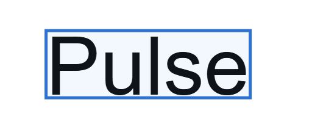
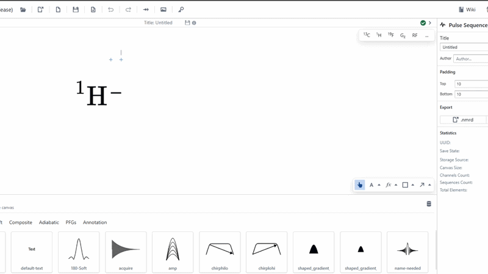
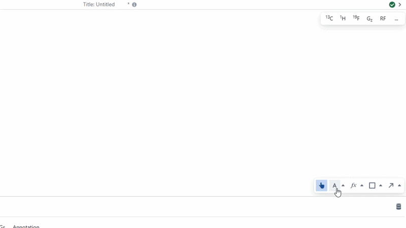

# Text

This is the basic text object for the application, intended for adding text that is not numerical or mathematical. The easiest way to add a Text object to the canvas is to use the [Text Tool](../../canvasTools/text.md) in the bottom right of the canvas and clicking the position at which you wish to create a text box.

Font size and family information can be modified under the "Style" heading in the right form. 

Text can be modified on the canvas by selecting a text object and double clicking it again.

:::note

LaTeX font sizes are normalised in Pulse Planner, so size 12 in this app should be the same as in Microsoft Word.

:::