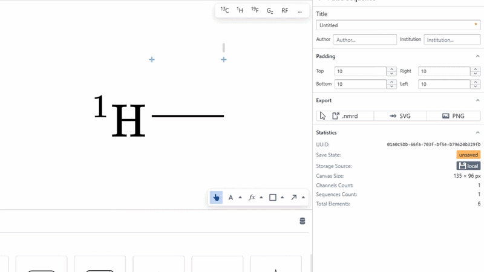
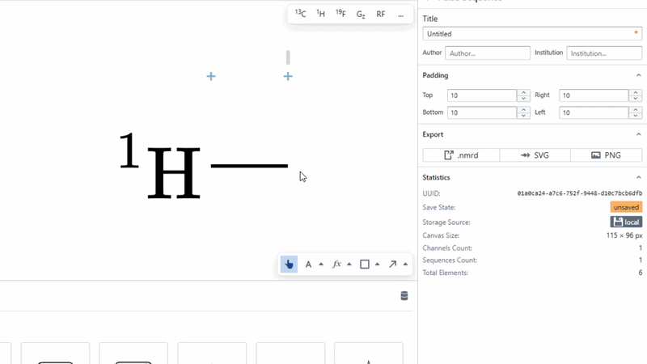
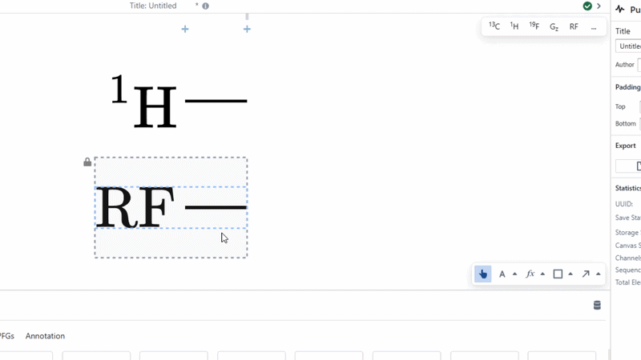
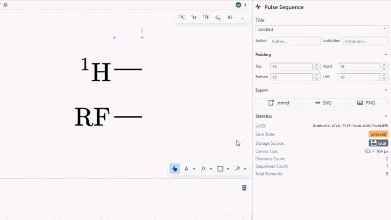

# Channel

The channel element represents a single track (or signal line) in a sequence. In pulse planner it is modelled as a grid, where one pulse can be placed in each column on each channel.

Every channel is made up of the following two components:

- **Channel Label**: A [LaTeX](./annotation/latex.md) visual component placed at the start of the channel. In order to modify this component, select the channel, then double click on the element. You will then have selected the element and can modify it using the form on the right of the screen. Additionally, as with all text objects, you can double click a selected LaTeX object to modify the LaTeX code directly. In order to change the spacing between the channel bar and the label, simply double click to select the LaTeX object and modify the right padding property. 

If you wish to further alter the position of the channel label, you may also use [offset](../concepts/offset.md).

- **Channel Bar**: A [rect element](./rectElement.md) component placed in the centre of the Channel. It spans from column 1 to the end of the channel. Code automatically lengthens the bar to fit the width of the channel. In order to select and modify the channel, click on the channel and then double click on the bar. You will now be able to modify the bar using the form on the right. For instance, you can change its colour and height.

:::tip

If you find it hard to double click on small objects like the channel bar, remember to zoom in with `CTRL` + `SCROLL`.

:::

### Reordering Channels

To reorder channels, select the channel you wish to reorder and use the channel reorder buttons that appear on the centre right of the canvas.

### Changing Channel Spacing

In order to change the gap between channels, one must modify the top and bottom padding attributes. This padding quantity can be seen as the grey outlined region while selecting a channel. In order to modify this quantity, either select a channel and change the `Padding.Top` and `Padding.Bottom` values in the form, or hover the mouse over the area immediately to the left of the sequence, where the channel padding overlay will appear. Then, proceed to select the desired padding quantity to modify it.

