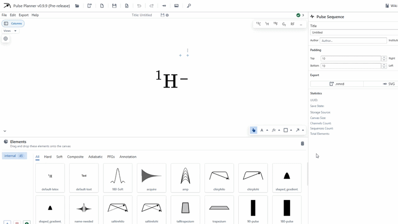

# Diagram

The diagram is the entire visual document. It is technically an element like any other, but contains important metadata and cannot be removed from the application. These things can be modified in the diagram form.

## Altering the document data

When no element is selected in the document, the default diagram form will be present on the right of the window. Here, the user can update the title of the diagram, and fill in author and institution information. Diagram padding can also be updated here, which changes how much whitespace is applied around the outmost objects on the canvas. This padding can be viewed by toggling the `View Diagram Boundary` button in the top left of the canvas.

There are also sections here for easy access to export controls, and a tab detailing some statistics regarding the diagram. 