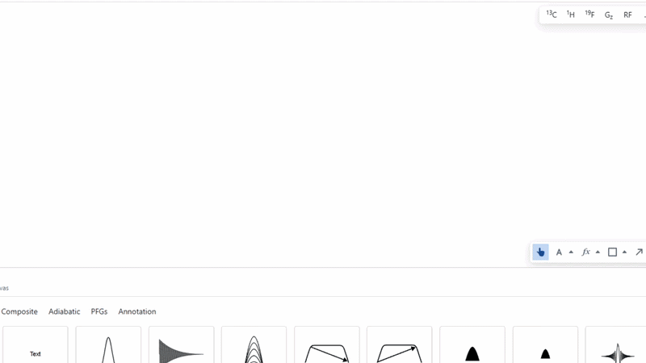

# LabelGroup

The LabelGroup object is designed to automatically position annotation type objects around pulses. It does this by creating a grid around a pulse and providing five automatic mounting positions in which to place annotations. These five positions are: top, left, right, bottom and centre. 

This object is created automatically when applying an annotation to a pulse object via annotation drop zones. To annotate a pulse object, simply drag a pulse onto the canvas, and ensure it is not selected. Then, begin dragging your annotation object over the pulse. Five blue regions representing the five mounting positions will appear, drop the annotation into one of these to automatically position it and create a LabelGroup object.

:::warning

If you delete all annotation from a LabelGroup, the resulting object is still a LabelGroup. This means that if you want to modify the pulse of that LabelGroup, you must double click the object to select the nested SVG or rect element. 

:::