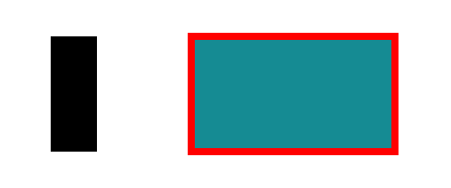

# Rect Element

The rect element is a simple rectangular object one can add to the canvas. You can change its fill colour, stroke colour and stroke thickness. This object is used for creating simple visual elements such as hard pulses.

:::note

To remove the stroke from a rect element, set the stroke width to 0.

:::

:::note

To remove the fill of a rect element, set the fill opacity to 0.

:::

:::tip

Due to the nature of SVG, rect strokes are applied equally to the inside and outside of the object. In order to make subtle pixel perfect adjustments to account for this, use [offset](../concepts/offset.md). 

:::