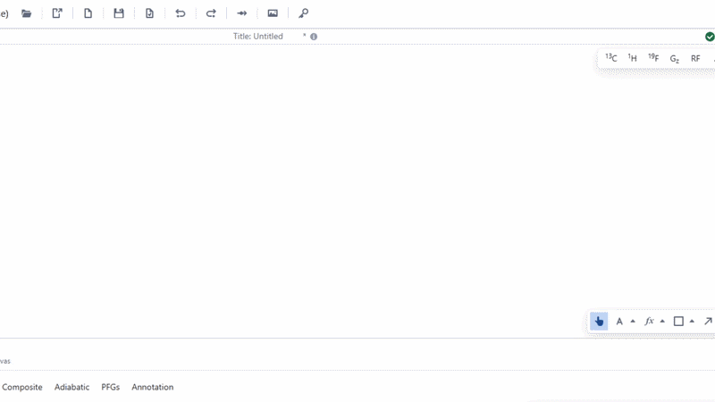

# SVG Element

The SVG Element is the primary visual unit that diagrams comprise of. The primary use of this object is to create complicated pulse objects that comprise of SVG paths. This application is not designed to handle the direct creation of these elements, and hence it is expected that SVG pulse assets are to be imported from other SVG editors.

To add a new SVG element to the diagram, drag and drop an SVG file into the canvas. An SVG element's SVG asset can be changed directly at any time by using the form on the right. This opens the `Asset Manager` where an SVG asset can be selected.

:::tip

Sometimes imported SVG assets do not have a element boundary (blue box) that tightly fits the visual element. This can mean that elements positioned in the diagram do not line up with each other pixel perfect. To fix this, use [offset](../concepts/offset.md).

:::

:::tip

SVG assets can be visually flipped using the controls on the right form.

:::