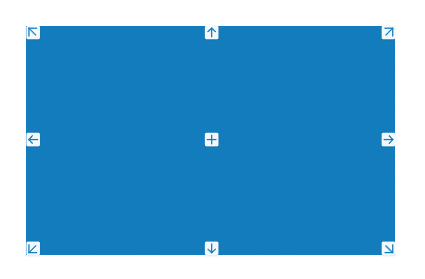
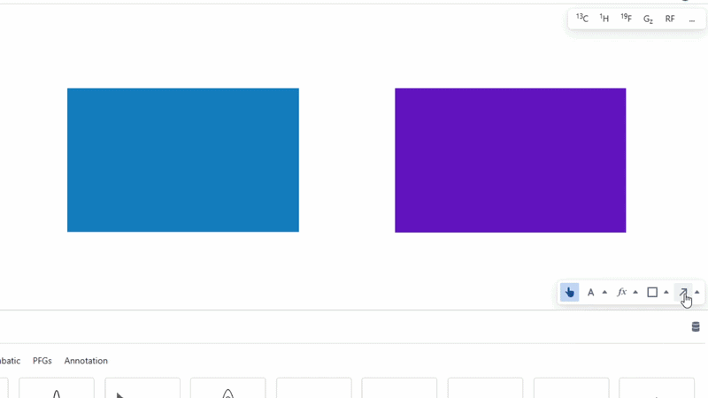
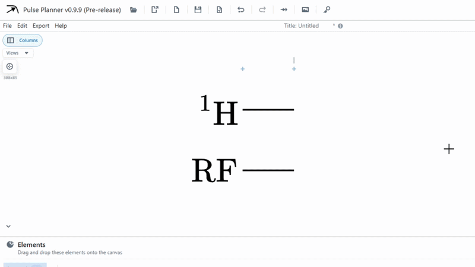

# Bindings

Bindings are another powerful concept in Pulse Planner. They allow the user to draw lines and rectangles that automatically position themselves relative to other objects on the diagram. They are especially useful when used in tandem with the columns layer.

Creating bindings is enabled for the [line](../canvasTools/line.md) and [box](../canvasTools/box.md) tools. Bindings can be created when using this tool when hovering over compatible elements. The you will notice the binding selector appear when you see nine white nodes appear over an object while hovering. 

In order to bind a line to this blue rectangle, we simply select one of these nodes when using the arrow tool. Then, you can optionally select another binding node to fully bind the start and end of the line.

A more important use-case is as follows.

## Column view

The large button in the top left of the canvas allows the user to interact with the columns of the diagram. Importantly, this allows the creation of bindings to the columns, meaning that vertical lines can be created that move automatically as your diagram grows.

:::note

Interaction with diagram elements behind the columns in column mode is restricted. Turn off column mode to continue editing the diagram.

:::