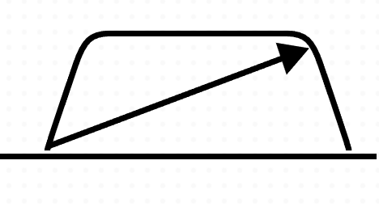
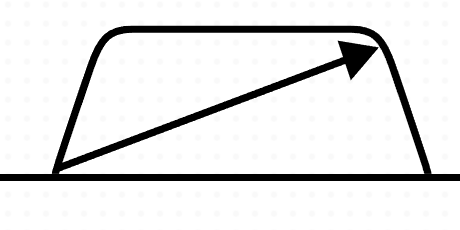

# Offset

Offset is another important concept in Pulse Planner. Offset allows the user to create a render-time translation on an element. What that allows you to do is make small tweaks to the position of elements while they remain fixed within the layout system. 

Offset comes in handy when an imported SVG element has not had its boundary fit nicely to the content. For instance, an asset may appear like this when first imported into the application and applied to a channel:

In order to fix this, an offset of 1 pixel on the Y axis can be applied to let the pulse lie flush with the `Channel Bar`:

Offset can be applied by selecting an element and changing the values under the "Offset" section or by selecting an element and using the arrow keys. Please note that Offset does not apply to elements with the "free" placement mode.