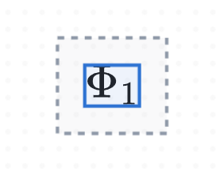
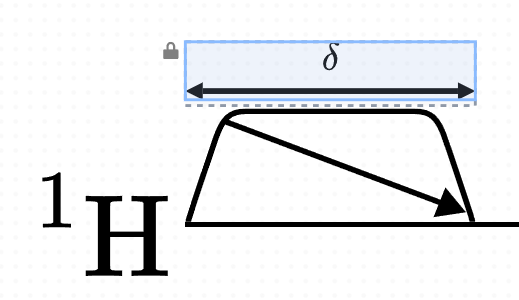

# Padding

Padding is an important concept in Pulse Planner, as it allows you to automatically specify the space between objects without having to position things manually. It therefore encourages consistent whitespace across a single diagram, and all diagrams created with the application. 

Padding serves to increase the size of an object outside its regular content bounds. One can see the effect of padding by observing the gray outline around a selected element on the canvas. 

Note the grey border around the selected element: that is the padding. The layout engine considers the object to be the size of the grey boarder. The content size is contained within the blue border.

Padding can be modified by selecting an element and changing the values under the "Padding" dropdown in the `Form`. 

Note the small slither of padding separating the `Label` here from the pulse.