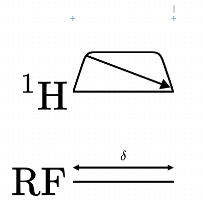

# Size Mode

A useful concept in Pulse Planner are "size modes". These allow you to set an element to grow to fit a space, or let a collection of objects fit tightly to its children. 

There are three size mode options:

- Fixed: the object is sized based on its content size attribute.
- Fit: the object is sized to fit its children.
- Grow: the object is sized to fill the size its parent allocates it.

Some objects have a limited collection of these options.

A primary use of size modes is when you wish to create a `Label` object that spans the width of a column. Rather than resizing that `Label` manually so that appears the same width as the column, one may set the `SizeMode.X` to "grow". This means the object is stretched to fit the width of it's container. 

The above `Label` object has its X size mode on grow hence it fills the width of the column automatically.

For most purposes, setting an element to have an X size mode of grow is all you need to know about this feature.

:::note

Note that objects with `free` placement mode are not eligible for the "grow" size mode.

:::