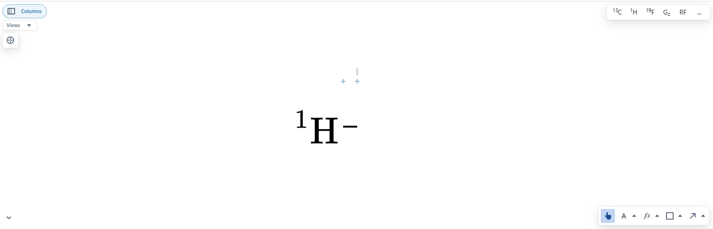
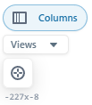
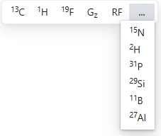
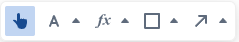

# Canvas

The canvas is where the you construct your diagram. It contains a few pieces of interface that are important to get used to. See [Quickstart](../quickstart.md) for interaction controls.

### Misc tools area (top left)

There are a few canvas related tools in the top left. 

1. Column view button. Select this buttons to reveal the columns of the diagram for binding lines.
2. The views dropdown allow you to show and hide different canvas overlays. These can be useful when overlays are getting in the way of what you are trying to do, or to present your diagram without clutter.
3. Centre diagram button. Centres the diagram content to the canvas view.

### Channel quick add

In the top right of the canvas you have access to a toolbar to quickly add common channels to the diagram. Select the "..." to reveal a dropdown containing a few more channels.

### Canvas toolbar

In the bottom right you will find the canvas toolbar. See [Canvas Tools](../canvasTools/) for how these work.

### Layer modifier

When an element is selected on the canvas, the layer editor appears above the canvas toolbar.