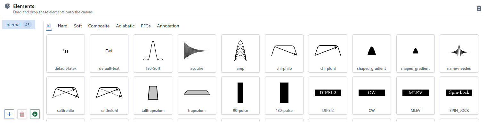
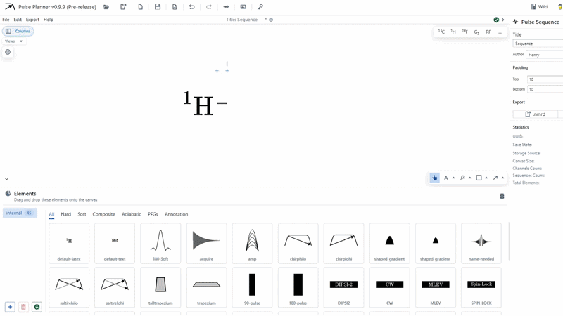
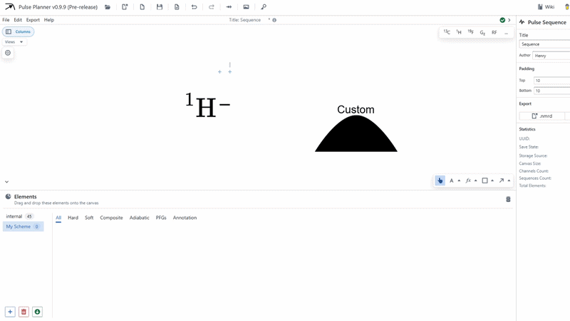

# Elements draw

The elements draw is the region occupying the bottom section of the screen. It contains an organisational system of pulse, acquisition and commonly used annotation objects for the convenient addition to the diagram.

To add one of these elements to the canvas, simply drag and drop them onto the canvas. 

:::warning

All dragging actions to the canvas respect the position of the **mouse pointer** rather than any drag preview of the element. When dragging pulses into pulse insert areas, you must position the mouse pointer over the region rather than the drag preview. 

:::

The elements draw also contains a sorting system for different pulse types and annotations.

### Adding Schemes

A Scheme is simply a collection of elements. These can be established in Pulse Planner, exported and shared with other research groups.

Import, export and delete schemes using the buttons in the bottom left of the element draw. Schemes are downloaded in a custom `.nmrs` file.

:::note

Template elements in the "internal" scheme cannot be deleted.

:::

### Adding templates

Template elements can be added to the elements draw by simply dragging and dropping into the area.

:::tip

Dragging and dropping an element into the elements draw while a filter is present automatically applies that filter to the template.

:::