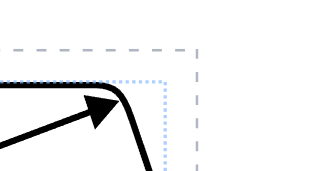

# Form

The form is the interface element on the right of the screen. When there is no selected element in the diagram, the application displays a general form for modifying information relating to the diagram. This includes diagram metadata such as the title or author, and more.

### Diagram Padding

You may also modify the diagram padding here. This is the amount of whitespace to be placed around the diagram when exporting. You can view this padding by turning on the ["Diagram Outline"](./canvas#misc-tools-area) and observing the blue and grey borders. The gap between the blue and grey border is controlled by this padding quantity. 

---

When an element is selected, this form will be replaced with a form to modify that element. 