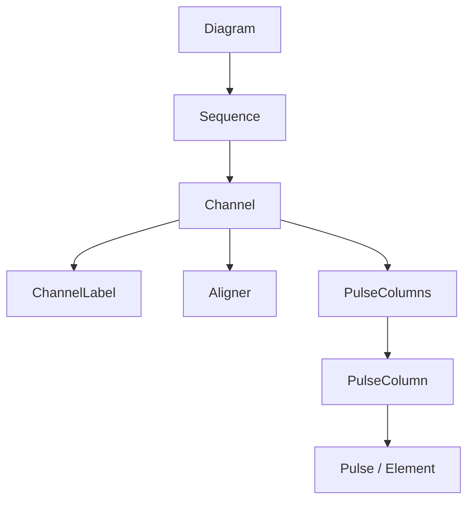

# Introduction to Pulse Planner

Pulse Planner is a web-based NMR (Nuclear Magnetic Resonance) pulse sequence diagramming tool. It enables scientists to quickly prototype, edit, and share high-quality, scientifically accurate NMR pulse sequence diagrams. 

## Architectural Overview

Pulse Planner runs entirely on the client side (with a supporting Express backend for user accounts and database integration). The core logic of the application is a declarative, hierarchical layout manager written in TypeScript. 

Rather than dragging shapes arbitrarily around a canvas, elements in Pulse Planner are organized hierarchically as **components**. A change in one component's dimensions or position (e.g., a pulse width) propagates automatically to shift neighboring components using a binding and alignment system.

### Core Hierarchical Structure

A diagram is represented by a parent `Diagram` object, which is composed of structured sub-components:

## Documentation Structure

- **[Sequence Diagram Concepts](./explanation.md)**: Overview of general terminology and the positioning engine.
- **Components & Logic (hasComponents)**: Documentation of individual classes and structures that manage state and layout:
  - **[Diagram](./components/diagram.md)**: The root node of a sequence diagram.
  - **[Sequence](./components/sequence.md)**: A collection of channels and pulse alignments.
  - **[Channel](./components/channel.md)**: A single track (or axis) containing pulses.
  - **[LabelGroup](./components/labelGroup.md)** & **[SimpleLabelGroup](./components/simpleLabelGroup.md)**: Handling annotations and labels.
  - **[Label](./components/label.md)**: Individual text labels.
  - **[SequenceAligner](./components/sequenceAligner.md)**: Logic for channel positioning.
