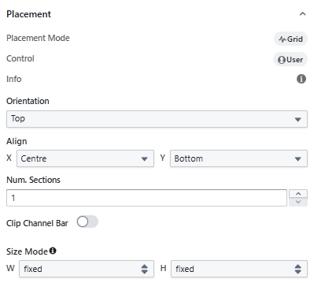
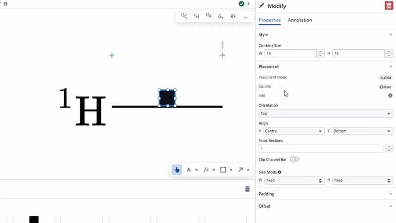
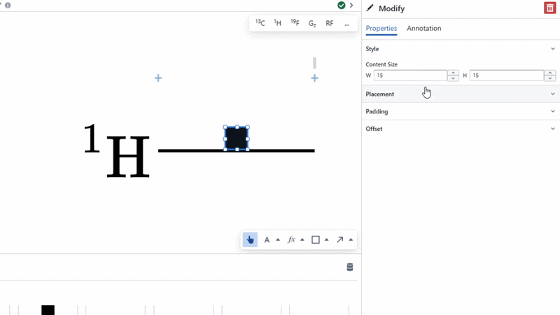
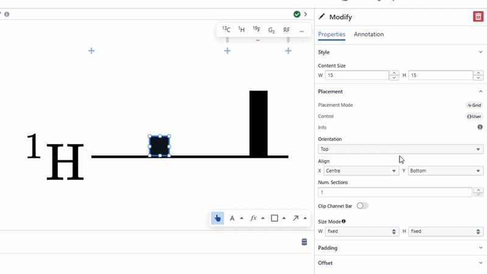
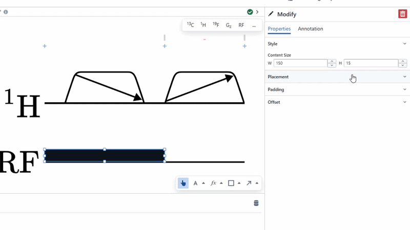
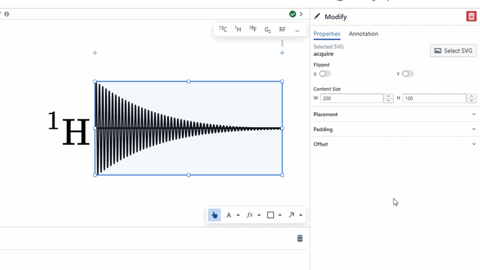

# Positioning Pulses

Positioning pulses in channels is the primary goal of Pulse Planner. Getting to grips with the concepts in this file is highly important to using Pulse Planner effectively.

"Pulse Data" is the interface by which users can position pulse type elements in the diagram. This is how you fine-tune the position of a pulse when it is added to a channel. To access the pulse data, add a pulse to a channel and select it, then navigate to the "Placement" tab on the right form. Here you will be provided with a few settings to change the positioning of the pulse.

- Orientation ["Top", "Bottom", "Both"]: This control decides whether the pulse goes on the top or bottom of the channel, or is centred to the channel bar.

:::note

When the orientation is set to "both", the Align Y value is forced to be "centre".

:::

- Align X ["Left", "Centre", "Right"]: Controls the horizontal alignment in the grid cell of the pulse.

- Align Y ["Top", "Centre", "Bottom"]: Controls the vertical alignment in the grid cell of the pulse.

- Num. Sections: This controls the width of the pulse in columns. For pulses that span multiple pulses on different channels, the number of sections can be increased to show this.

- Clip channel bar [BOOLEAN]: This is a stylistic control that determines whether the body of the pulse deletes the channel bar below it, primarily used for Acquire.

